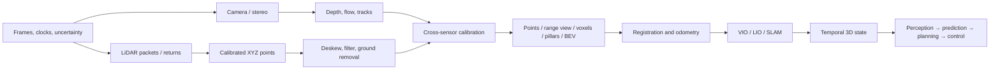

# Temporal Vision, Tracking, 3D Perception, and State Estimation

Temporal and 3D systems must preserve geometry across coordinate frames and state across time. Many severe failures come from timestamp, calibration, uncertainty, and lifecycle mistakes rather than the neural model itself.

Suggested study time: 30–40 hours.

## Learning outcomes

You should be able to:

- derive local optical-flow constraints and identify their limitations;
- design a tracking-by-detection pipeline with explicit state and lifecycle;
- apply Kalman filtering and data association with defensible uncertainty;
- construct depth and point clouds from calibrated measurements;
- evaluate tracking, depth, odometry, and 3D detection appropriately;
- reason about ego motion, time synchronization, and sensor fusion;
- diagnose drift, frame errors, and real-time pipeline failures.

## Dependency map: measurement to planning coordinates



The order matters. Registration assumes calibrated measurements; deskew assumes
time and ego motion; temporal fusion assumes a common reference frame; planning
assumes the world state distinguishes observed, free, occupied, uncertain, and
stale information.

## 1. Time is part of the measurement

A sample is not fully described by its tensor. It also has:

- acquisition timestamp;
- clock domain and synchronization quality;
- exposure interval or scan pattern;
- sensor calibration version;
- sequence and frame identifiers;
- latency between acquisition and availability.

Processing timestamps cannot replace acquisition timestamps. A camera frame, LiDAR sweep, and radar scan may represent different intervals. Fusing them at a nominal frame number can create systematic spatial error around moving objects.

## 2. Optical flow

Brightness constancy assumes

$$
I(x+u,y+v,t+\Delta t)=I(x,y,t).
$$

First-order expansion yields

$$
I_xu+I_yv+I_t=0.
$$

One equation cannot determine two velocity components: the aperture problem. Lucas–Kanade assumes approximately constant flow in a local window and solves

$$
\begin{bmatrix}
\sum I_x^2 & \sum I_xI_y\\
\sum I_xI_y & \sum I_y^2
\end{bmatrix}
\begin{bmatrix}u\\v\end{bmatrix}
=
-
\begin{bmatrix}
\sum I_xI_t\\
\sum I_yI_t
\end{bmatrix}.
$$

The matrix is informative when it has two sufficiently large eigenvalues. Image pyramids extend the small-motion assumption but can lose fine structure.

Brightness constancy fails under exposure changes, specularities, shadows, occlusion, motion blur, and non-Lambertian surfaces. Forward–backward consistency is a useful but imperfect confidence check.

## 3. Tracking-by-detection

A common pipeline is:

1. predict track state to the current acquisition time;
2. generate detections;
3. compute gated association costs;
4. solve assignment;
5. update matched tracks;
6. initialize, age, confirm, or delete tracks.

Track state may include position, velocity, box size, orientation, class belief, appearance embedding, and uncertainty. Track lifecycle rules affect false tracks, fragmentation, and re-identification.

Association costs can combine:

- geometric overlap;
- Mahalanobis distance;
- class compatibility;
- appearance distance;
- depth or 3D distance.

Costs need comparable scales. A hard gate should reject physically impossible matches before Hungarian assignment.

## 4. Kalman filtering

For linear dynamics:

$$
x_k=F_kx_{k-1}+w_k,
\qquad
z_k=H_kx_k+v_k,
$$

with \(w_k\sim\mathcal{N}(0,Q_k)\) and \(v_k\sim\mathcal{N}(0,R_k)\).

Prediction:

$$
\hat{x}_{k|k-1}=F_k\hat{x}_{k-1|k-1},
$$

$$
P_{k|k-1}=F_kP_{k-1|k-1}F_k^\top+Q_k.
$$

Update:

$$
S_k=H_kP_{k|k-1}H_k^\top+R_k,
$$

$$
K_k=P_{k|k-1}H_k^\top S_k^{-1},
$$

$$
\hat{x}_{k|k}
=
\hat{x}_{k|k-1}
+K_k(z_k-H_k\hat{x}_{k|k-1}).
$$

The covariance should represent uncertainty, not a tuning decoration. Innovation statistics can reveal inconsistent \(Q\), \(R\), timing, or measurement models.

Use a numerically stable covariance update such as the Joseph form when appropriate. Never form a matrix inverse when a solve is available.

## 5. Tracking metrics

Metrics emphasize different failures:

- IDF1 emphasizes identity consistency;
- HOTA balances detection, association, and localization components;
- MOTA combines misses, false positives, and identity switches but can be dominated by detection;
- track fragmentation and latency may matter operationally even when headline metrics look good.

Evaluation must define ignored regions, class matching, confidence thresholds, interpolation, and frame-rate assumptions.

## 6. Stereo depth and point clouds

For rectified stereo with focal length \(f\), baseline \(B\), and disparity \(d\):

$$
Z=\frac{fB}{d}.
$$

Depth sensitivity is

$$
\left|\frac{\partial Z}{\partial d}\right|
=
\frac{fB}{d^2}.
$$

Thus a fixed disparity error causes much larger depth error for distant points. Zero or very small disparity is unstable.

For pixel \((u,v)\) and depth \(Z\):

$$
X=Z\frac{u-c_x}{f_x},
\qquad
Y=Z\frac{v-c_y}{f_y}.
$$

Depth may be axial distance \(Z\), range along a ray, inverse depth, disparity, or a normalized network output. Never assume the representation.

A point cloud should carry frame, timestamp, units, invalid-value policy, and possibly per-point acquisition time and uncertainty.

## 7. LiDAR measurement and point generation

A LiDAR front end is a measurement pipeline rather than a file-format reader:

```text
emission → return detection → range/signal/return ID → timestamped packet
→ beam/azimuth calibration → XYZ → deskew → filtering → reference frame
```

For pulsed time of flight,

$$
r=\frac{c\Delta t}{2}.
$$

For calibrated azimuth \(\theta\) and elevation \(\phi\), one common sensor-frame
conversion is

$$
x=r\cos\phi\cos\theta,\qquad
y=r\cos\phi\sin\theta,\qquad
z=r\sin\phi.
$$

The exact axis order and angle convention are sensor contracts. Use the
manufacturer's beam calibration rather than assuming uniformly spaced rings.
Preserve range, raw signal, calibrated reflectivity, near-infrared level,
return index, ring/beam ID, column timestamp, validity flags, and uncertainty
when available. These fields are not interchangeable.

Required checks include packet loss, invalid range codes, dual-return policy,
minimum/maximum range, azimuth wrap, beam-table version, unit conversion, and
the transform between the LiDAR and ego frames. Weather, mixed pixels,
grazing incidence, retroreflectors, multipath, dust, and partial occlusion can
produce physically plausible but misleading returns.

## 8. Deskew, filtering, and ground extraction

A rotating scan is collected over an interval. Let \({}^WT_L(t)\) map a LiDAR
frame at time \(t\) into the world frame. A point acquired at \(t_i\), expressed
in the LiDAR frame at that instant, is moved to reference time \(t_r\) by

$$
{}^{L(t_r)}p_i=
\left({}^WT_L(t_r)\right)^{-1}
{}^WT_L(t_i){}^{L(t_i)}p_i.
$$

The trajectory may come from IMU integration, wheel/visual/LiDAR odometry, or
a fused pose estimate. Interpolate orientation on the rotation manifold and
translation in a stated motion model. A wrong clock offset can leave curved
walls and duplicated edges even when the extrinsic matrix is correct.

A defensible front-end order is:

1. decode packets and preserve acquisition time;
2. apply beam calibration and reject invalid/range-gated returns;
3. generate points with return metadata;
4. deskew to one timestamp;
5. transform to the declared ego/local frame;
6. crop the region of interest and remove isolated/weather noise;
7. estimate ground or road surface;
8. downsample or encode for the task.

Ground-removal choices expose different assumptions:

| Method | Prefer when | Main failure |
|---|---|---|
| Fixed height threshold | Flat road and fixed mounting | Hills, banking, suspension motion |
| RANSAC plane | One dominant local plane | Curved roads, multiple levels, traffic occlusion |
| Grid/slope or progressive filter | Rolling road geometry | Threshold tuning and sparse distant cells |
| Range-image segmentation | Native scan topology matters | Seam, projection collision, sensor dependence |
| Learned semantic ground | Rich geometry and sufficient labels | Domain shift and overconfident mistakes |

## 9. Choose a spatial representation

For voxel size \((v_x,v_y,v_z)\) and grid origin
\((x_{min},y_{min},z_{min})\),

$$
i=\left\lfloor\frac{x-x_{min}}{v_x}\right\rfloor,\quad
j=\left\lfloor\frac{y-y_{min}}{v_y}\right\rfloor,\quad
k=\left\lfloor\frac{z-z_{min}}{v_z}\right\rfloor.
$$

- **Raw points** avoid quantization but have irregular neighborhood access.
- **Range images** preserve LiDAR beam adjacency and enable fast 2D processing,
  but introduce seams, collisions, and sensor-specific topology.
- **Pillars** collapse vertical cells into columns and enable efficient 2D BEV
  convolution; they lose detailed vertical separation.
- **Sparse voxels** preserve 3D height structure while skipping empty cells;
  coordinate construction and sparse-kernel support still cost time.
- **Dense voxels** have simple regular neighborhoods but cubic memory growth.
- **2D BEV** is a compact shared interface for detection, maps, tracking, and
  planning but can hide vertical geometry.
- **3D occupancy** represents free, occupied, and unknown volume beyond a fixed
  object vocabulary, at substantial labeling and memory cost.

Halving every voxel dimension can create up to eight times as many cells in a
fixed dense volume. Compare quality, memory, latency, range-bin behavior, and
quantization—not only headline accuracy.

## 10. Calibration is not registration

**Calibration** estimates a persistent spatial and temporal relationship
between sensors. **Registration** estimates the relative pose between two
scene observations, usually changing from scan to scan. Calibration supplies
the transform that fusion assumes; registration supplies ego motion or local
map alignment.

For a LiDAR point projected into a camera,

$$
\lambda\tilde p_C=K\,{}^CT_L
\begin{bmatrix}p_L\\1\end{bmatrix}.
$$

Require positive camera depth, image bounds, the correct distortion convention,
time alignment, and a z-buffer for occlusion-aware colorization. RGB pixels are
not a geometric point cloud: ICP cannot directly register RGB to LiDAR unless
the image has first produced metric 3D through stereo, RGB-D, or another depth
source.

For local scan registration, point-to-point ICP minimizes

$$
\min_{R,t}\sum_i\|Rp_i+t-q_i\|^2,
$$

while point-to-plane ICP minimizes

$$
\min_{R,t}\sum_i\left[n_i^T(Rp_i+t-q_i)\right]^2.
$$

Use point-to-plane ICP or GICP when overlap, initialization, and normals are
good. Use a global feature/place prior plus local refinement when the initial
pose is poor. NDT fits local Gaussian distributions and optimizes likelihood
without explicit closest-point pairs; it can provide a smoother objective but
still needs sufficient geometry and an adequate starting region. Use
continuous-time registration or IMU deskew when motion within a scan is large.

Common registration failures are low overlap, repetitive structure, moving
objects, tunnels or open roads with weak constraints, bad normals, scale
mismatch, and a local minimum that still reports a small residual.

## 11. Odometry, VIO, LIO, and SLAM

A localization stack contains several distinct stages:

1. a front end performs feature tracking, scan matching, and data association;
2. odometry estimates locally continuous incremental motion;
3. IMU preintegration or filtering supplies high-rate motion and bias state;
4. a back end combines visual/LiDAR, inertial, wheel, GNSS, and map factors;
5. loop retrieval proposes a revisit;
6. geometric verification accepts or rejects it;
7. pose-graph or factor-graph optimization corrects global drift;
8. the corrected trajectory updates the map and reference-frame relationship.

A generic robust factor-graph objective is

$$
x^*=\arg\min_x\sum_k
\rho\!\left(r_k(x)^T\Sigma_k^{-1}r_k(x)\right).
$$

- Monocular visual odometry is low-cost but has scale ambiguity and depends on
  texture and illumination.
- Stereo odometry has metric scale but its depth weakens with range.
- VIO adds metric scale, gravity, and high-rate motion but is sensitive to IMU
  bias, initialization, timing, and camera-IMU calibration.
- LiDAR odometry is metric and lighting-independent but degenerates in weak or
  repetitive geometry.
- LIO couples LiDAR and IMU for motion robustness, at the cost of tighter time,
  extrinsic, and noise-model requirements.
- GNSS/map factors add global reference but must be gated for outages,
  multipath, map change, and frame-conversion errors.

Odometry is locally continuous and may drift; a map frame can be globally
corrected and therefore jump. Loop closure requires retrieval **and** geometric
verification—a false loop can corrupt the complete map.

Evaluate trajectories after declaring alignment. Absolute trajectory error
measures global consistency; relative pose error measures local drift. State
whether evaluation removes translation, rotation, and monocular scale.

## 12. Temporal 3D state and sensor fusion

A 3D box requires center, dimensions, orientation, frame, timestamp, covariance,
and convention. State whether dimensions are length/width/height, whether the
center is geometric or on the ground, the yaw axis/sign, and units. BEV IoU and
full 3D IoU measure different errors.

Fusion can occur at raw, feature, BEV/voxel, object, track, or factor level.
Early fusion preserves information but has tight alignment and missing-sensor
requirements. Late fusion is modular and easier to inspect but discards
low-level complementary evidence. Sensor errors can be correlated; treating
correlated estimates as independent makes covariance unjustifiably small.
Delayed measurements require buffering, state rewind, smoothing, or an explicit
bounded approximation.

## 13. Where geometry meets the driving stack

The output of this module is not a collection of boxes; it is a timestamped,
uncertainty-aware world state:

```text
sensors → synchronized calibrated measurements → localization
→ detection/segmentation/occupancy/tracking
→ future trajectories and occupancy flow
→ behavior and motion planning
→ trajectory tracking/control → new observations
```

Perception estimates the present; prediction represents plausible futures;
planning selects a safe, legal, comfortable action under those futures; control
tracks the chosen trajectory. Keep these evaluation boundaries visible so a
better perception proxy metric is not assumed to imply better closed-loop
driving.

## Practical labs

### Lab 1 — Sparse optical flow

- Implement pyramidal Lucas–Kanade or a simplified version.
- Select features using the second-moment matrix.
- Add forward–backward consistency.
- Evaluate endpoint error on synthetic translated and affine images.
- Test blur, exposure change, occlusion, and motion larger than one pyramid level.

### Lab 2 — Multi-object tracker

Build a tracker around recorded detections.

- Use a constant-velocity Kalman filter.
- Gate by Mahalanobis distance and class.
- Compare IoU-only and combined appearance/geometric association.
- Define tentative, confirmed, lost, and deleted lifecycle states.
- Evaluate IDF1/HOTA or an appropriate equivalent.

Create scenarios with crossings, missed detections, false positives, and timestamp jitter.

### Lab 3 — Stereo and uncertainty

- Rectify or use pre-rectified stereo data.
- Estimate disparity and apply left–right consistency.
- Convert disparity to depth and point cloud.
- Propagate a one-pixel disparity uncertainty to depth.
- Evaluate by distance bins and valid-pixel coverage.

Visualize confidence and failure around occlusion boundaries and repetitive texture.

### Lab 4 — Coordinate-frame test harness

Implement a small transform graph.

- Use explicit source/destination frame names.
- Verify inverse and composition identities.
- Project LiDAR or synthetic 3D points into an image.
- Inject a small rotation, translation, and time offset separately.
- Measure their image-space effects by depth and object velocity.

### Lab 5 — LiDAR front end and deskew

- Convert calibrated range/azimuth/elevation samples into XYZ with ring,
  timestamp, signal, and return metadata.
- Simulate a moving spinning LiDAR viewing a wall.
- Deskew with a known trajectory, then inject time and extrinsic errors.
- Compare height threshold, RANSAC plane, and grid/slope ground removal.
- Report wall residual, retained-point rate, runtime, and range slices.

### Lab 6 — ICP and NDT registration

- Implement point-to-point and point-to-plane ICP or inspect a library
  implementation against scalar reference cases.
- Sweep initial translation/yaw and visualize the convergence basin.
- Add outliers, moving objects, weak overlap, and a geometrically degenerate
  corridor.
- Compare a distribution-based NDT implementation with ICP under a fixed
  compute budget.
- Require a failure/uncertainty output rather than always returning a pose.

### Lab 7 — Visual or LiDAR-inertial odometry

- Track or match features across a sequence.
- Or register sequential LiDAR scans with IMU-based deskew.
- Estimate motion with robust geometry and a named reference timestamp.
- Apply cheirality and parallax checks.
- Triangulate/refine for vision, or inspect degeneracy and IMU bias for LIO.
- Compare relative and absolute trajectory error.
- Detect and report tracking failure instead of emitting an arbitrary pose.

### Lab 8 — Asynchronous fusion and downstream boundary

Simulate a moving object with camera-like position and radar-like velocity observations at different rates.

- Use acquisition timestamps.
- Compare naive frame-index fusion with timestamp-aware prediction.
- Introduce clock offset and delayed observations.
- Plot innovation and covariance consistency.
- Define behavior for stale or missing sensors.
- Compare how the same perception error changes a constant-velocity prediction
  and a simple collision-cost planner.

## System failure modes

- Using processing time instead of acquisition time.
- Assuming sensors share a clock because timestamps have the same units.
- Applying a current calibration to historical replay.
- Mixing ego, sensor, camera, and map frames.
- Confusing axial depth, Euclidean range, disparity, and inverse depth.
- Treating an invalid depth value as zero-distance geometry.
- Ignoring rolling shutter or per-point LiDAR acquisition time.
- Associating before ego-motion compensation.
- Tuning process noise to hide a bad motion or timestamp model.
- Covariance becoming asymmetric, non-positive, or unjustifiably small.
- Unbounded track retention causing ghosts and state growth.
- Detector threshold changes invalidating tracker tuning.
- Optimizing MOTA while identity behavior degrades.
- Monocular odometry reporting metric scale without a scale source.
- A false loop closure corrupting the complete map.
- Queueing stale frames until latency becomes unsafe.
- Evaluating a pipeline on frames it silently dropped.
- Treating a calibration matrix as a scan-to-scan registration result, or vice
  versa.
- Running ICP on a motion-distorted scan and blaming the map for curved walls.
- Removing ground before transforming points into the declared reference frame.
- Declaring unknown/unobserved occupancy as free space.
- Adding loop closure from retrieval without geometric verification.

## Review and derivation questions

1. Derive the optical-flow constraint and explain the aperture problem.
2. Why do image pyramids help optical flow, and when do they hurt?
3. Design association costs for two objects crossing.
4. What do \(Q\) and \(R\) mean in a Kalman filter?
5. How would innovation statistics reveal a bad model?
6. Compare IDF1, HOTA, and MOTA.
7. Why does stereo depth uncertainty grow rapidly with distance?
8. What metadata must accompany a point cloud?
9. Explain how a 50 ms time offset appears for a moving object.
10. Why is monocular scale unobservable?
11. Compare ATE and relative pose error.
12. What can cause a low-reprojection-error but wrong trajectory?
13. Compare early and late sensor fusion.
14. How should a real-time perception system react to overload?
15. Derive the LiDAR spherical-to-Cartesian conversion for the chosen axes.
16. Why does a rotating LiDAR require per-point motion compensation?
17. Distinguish camera-LiDAR calibration from scan registration.
18. Compare point-to-plane ICP and NDT, including initialization and degeneracy.
19. Why must loop retrieval be followed by geometric verification?
20. Trace one timestamp error through localization, occupancy, prediction, and
    planning.

## Definition of done

- [ ] Every temporal measurement retains acquisition time and clock provenance.
- [ ] Optical flow is evaluated on controlled motion and known violations.
- [ ] Tracker lifecycle and association gates are explicit and tested.
- [ ] Kalman covariance and innovation consistency are inspected.
- [ ] Tracking results include identity and detection-oriented metrics.
- [ ] Stereo depth reports error and coverage by distance.
- [ ] All point clouds and boxes document frame, units, and conventions.
- [ ] Transform composition/inversion has property-style tests.
- [ ] Odometry states its alignment and detects degenerate motion.
- [ ] Timestamp-aware fusion outperforms naive fusion in simulation.
- [ ] LiDAR point generation preserves beam, return, time, frame, and unit metadata.
- [ ] Deskew is validated on a known-motion geometric oracle.
- [ ] At least two registration methods are compared over initial pose and overlap.
- [ ] Calibration and registration are distinguished in code and documentation.
- [ ] Loop closure includes geometric verification and a rejection test.
- [ ] At least eight system failures are reproduced or tested.
- [ ] You can answer at least 16 of the 20 review questions without notes.

## Primary sources and further study

- [Stanford CS231A course notes: camera models, stereo, flow, and optimal estimation](https://web.stanford.edu/class/cs231a/course_notes.html)
- [ROS REP-105 coordinate-frame semantics](https://ros.org/reps/rep-0105.html)
- [Ouster sensor data: range, signal, reflectivity, timestamps, and XYZ conversion](https://docs.ouster.com/sensor-docs/image_route1/image_route3/sensor_data/sensor-data.html)
- [VoxelNet: learned voxel encoding for point-cloud detection](https://openaccess.thecvf.com/content_cvpr_2018/html/Zhou_VoxelNet_End-to-End_Learning_CVPR_2018_paper.html)
- [PointPillars: fast pillar encoders](https://arxiv.org/abs/1812.05784)
- [RangeNet++ reference implementation and paper](https://github.com/PRBonn/rangenet_lib)
- [Besl and McKay: Iterative Closest Point](https://graphics.stanford.edu/courses/cs164-09-spring/Handouts/paper_icp.pdf)
- [Biber and Straßer: Normal Distributions Transform](https://citeseerx.ist.psu.edu/document?doi=1f16244ce2e78881c7c96b33796a930ce73f7972&repid=rep1&type=pdf)
- [CT-ICP: continuous-time LiDAR odometry](https://arxiv.org/abs/2109.12979)
- [VINS-Mono: visual-inertial state estimation](https://arxiv.org/abs/1708.03852)
- [LIO-SAM: tightly coupled LiDAR-inertial smoothing and mapping](https://github.com/TixiaoShan/LIO-SAM)
- [FAST-LIO2: direct LiDAR-inertial odometry](https://arxiv.org/abs/2107.06829)
- [ORB-SLAM3: visual, visual-inertial, and multi-map SLAM](https://arxiv.org/abs/2007.11898)
- [GTSAM: factor graphs for smoothing and mapping](https://github.com/borglab/gtsam)
