# Autonomy Perception and Sensor Fusion

Estimated effort: 18-24 focused hours plus capstone work.

This module studies the complete dependency chain from physical sensor
measurements to vehicle action. The central question is not "Which fusion model
is newest?" It is: **Can the system create a trustworthy, timely spatial state
and use it to predict, plan, and control when sensors, calibration, weather,
maps, traffic, and compute are imperfect?**

The material is organized by observable information and system interfaces. It
does not assume that a modular, jointly trained, or end-to-end architecture is
always superior; each must be compared under identical data, timing, fault,
and closed-loop conditions.

## Outcomes

By the end, you should be able to:

- define a frame convention and transform camera, LiDAR, radar, IMU, and ego
  data without silently reversing a transform;
- diagnose intrinsic, extrinsic, synchronization, observability, and data-
  association failures;
- compare early, feature-level, BEV-level, and late fusion using explicit
  accuracy, robustness, latency, and memory criteria;
- build and evaluate a temporal perception/tracking pipeline by scenario, not
  only by a global leaderboard metric;
- inject realistic sensor faults and specify degraded behavior;
- connect failure mining, data selection, retraining, validation, deployment,
  and monitoring as a continuous-learning loop; and
- trace uncertainty and latency through perception, prediction, planning, and
  control rather than optimizing one module in isolation.

## Dependency flow

```mermaid
flowchart LR
    A["Photons / LiDAR returns / radar / inertial samples"] --> B["Decode, timestamp, calibrate"]
    B --> C["Point/depth generation, deskew, filtering"]
    C --> D["Registration, odometry, localization / SLAM"]
    D --> E["Camera/LiDAR/radar fusion"]
    E --> F["Objects, lanes, maps, BEV, occupancy"]
    F --> G["Tracking and prediction distributions"]
    G --> H["Behavior and motion planning"]
    H --> I["Trajectory tracking and control"]
    I --> A
```



Every arrow is a contract: frame, timestamp, units, covariance, validity,
maximum age, and failure behavior. A model can be trained end to end while
these contracts remain explicit and independently testable.

## Prerequisites

- Homogeneous coordinates, camera projection, least squares, probability, and
  basic optimization.
- Detection metrics, assignment, Kalman filtering, and PyTorch familiarity.
- Ability to write tested Python. C++ is strongly recommended for the runtime
  portion.

If you cannot derive a pinhole projection or explain covariance propagation,
return to the geometry and estimation modules before attempting Assignment 2.

## 1. Start with a coordinate contract

Never begin fusion code with an unnamed `4x4` matrix. Record:

- frame name and axis directions;
- handedness and rotation convention;
- timestamp source, clock domain, and units;
- whether a transform is active or passive; and
- the direction encoded by its name.

This module uses column vectors and names a transform by destination and source:

```text
p_camera = T_camera_from_ego @ T_ego_from_lidar @ p_lidar
```

For rigid transforms:

```text
T_b_from_a = [R_b_from_a  t_b_from_a]
             [    0            1     ]

T_a_from_b = inverse(T_b_from_a)
```

For a calibrated camera:

```text
z * [u, v, 1]^T = K [R_camera_from_world | t_camera_from_world] p_world
```

Required checks include identity, inverse, round-trip, composition, and a point
with a hand-computed answer. A visualization is useful but cannot replace the
numeric tests.

### Timing is geometry

A spatially correct transform at the wrong time is still wrong. To first order,
a time offset `dt` produces translation error near `||v|| * dt` and angular
error near `||omega|| * dt`. Rolling shutter, scan motion, CAN latency, dropped
frames, sensor buffering, and clock drift require explicit modeling.

For every signal, write down:

1. capture time versus arrival time;
2. exposure or scan interval;
3. interpolation/extrapolation method;
4. maximum tolerated age; and
5. behavior when the tolerance is exceeded.

## 2. Know what each sensor contributes

| Sensor | Strong signal | Important weaknesses | Failure probes |
|---|---|---|---|
| Camera | Texture, class, lane/light semantics, dense angular resolution | Depth ambiguity, lighting/weather, exposure, blur | Darkness, glare, rain, occlusion, dirty lens |
| LiDAR | Metric range and shape, sparse 3D geometry | Sparsity at range, reflectivity/weather, moving scan | Point dropout, range bins, calibration/time offset |
| Radar | Range and radial velocity, weather robustness | Multipath, low angular resolution, ghost targets | Stationary objects, metal structures, sparse returns |
| IMU | High-rate angular velocity and acceleration | Bias, drift, vibration, temperature | Bias step, saturation, time drift |
| GNSS/GPS | Global position outdoors | Urban canyon, multipath, outages, frame conversion | Tunnel, offset jump, stale fix |

A rigorous design states what information is observable from the available
sensors and what remains ambiguous. Adding sensors does not automatically add
reliable information if calibration, timing, coverage, or training data is poor.

## 3. Build a trustworthy LiDAR front end

LiDAR data enters the autonomy stack through a physical and temporal pipeline:

```text
laser return → range/signal/reflectivity/return ID → timestamped packet
→ beam calibration → XYZ point → deskew → ego frame
→ range/weather filtering → ground model → task representation
```

For pulsed time of flight, \(r=c\Delta t/2\). For calibrated azimuth
\(\theta\) and elevation \(\phi\), one common convention is

$$
p_L=
\begin{bmatrix}
r\cos\phi\cos\theta &
r\cos\phi\sin\theta &
r\sin\phi
\end{bmatrix}^T.
$$

Use the sensor's beam and axis convention rather than assuming evenly spaced
angles. Preserve point time, ring/beam, return number, signal, reflectivity,
validity, and calibration-table version. A scan captured by a moving vehicle is
not instantaneous. If \({}^WT_L(t)\) maps LiDAR coordinates at time \(t\) to
world coordinates, deskew point \(p_i\) to reference time \(t_r\) with

$$
{}^{L(t_r)}p_i=
\left({}^WT_L(t_r)\right)^{-1}
{}^WT_L(t_i){}^{L(t_i)}p_i.
$$

Filter in a documented order. Range/invalid-return checks can precede deskew;
precise ground fitting and multi-sweep accumulation require a common reference
time and frame. Compare fixed-height, RANSAC-plane, grid/slope, range-image,
and learned ground methods against hills, banking, bridges, sparse range, rain,
and dense traffic. Always report retained-point rate as well as task accuracy.

## 4. Separate calibration, registration, and localization

- **Calibration** estimates persistent camera intrinsics plus spatial and
  temporal relationships among sensors.
- **Registration** estimates the relative pose between scene observations,
  such as consecutive LiDAR scans.
- **Odometry** integrates local motion and is continuous but drifts.
- **Localization** estimates vehicle pose in a map/global frame.
- **SLAM** jointly estimates trajectory and a persistent map, with optional
  loop closure for global consistency.

For camera-LiDAR projection,

$$
\lambda\tilde p_C=K\,{}^CT_L
\begin{bmatrix}p_L\\1\end{bmatrix}.
$$

Projection also requires synchronized capture time, positive camera depth,
matching distortion convention, image bounds, and occlusion handling. A z-buffer
prevents a farther LiDAR return from coloring over a nearer surface.

For scan matching, use point-to-plane ICP/GICP when initialization, overlap,
and normals are reliable. Use a global feature or place prior before local
refinement when initialization is poor. NDT fits local Gaussian distributions
and avoids explicit closest-point correspondences, but it still degenerates in
weak/repetitive geometry. Use IMU deskew or continuous-time registration when
intra-scan motion is material. Registration residual alone is not a confidence
proof: inspect Hessian/eigenvalue structure, overlap, inlier spatial coverage,
motion priors, and consistency with independent sensors.

## 5. Choose a fusion location deliberately

| Pattern | Benefit | Cost/risk | Use when |
|---|---|---|---|
| Raw/early fusion | Preserves low-level information | Alignment-sensitive and expensive | Sensors have compatible sampling and excellent calibration |
| Feature fusion | Learns cross-sensor relationships | Harder to debug; missing-sensor behavior must be trained | Large paired datasets and sufficient compute exist |
| BEV/intermediate fusion | Common spatial frame; useful for planning | Projection/depth errors can be hidden | Spatial reasoning and multi-camera coverage dominate |
| Object/late fusion | Modular, testable, easier degradation | Discards information before fusion | Independent sensor stacks or safety decomposition matter |
| Filter/track fusion | Explicit uncertainty and temporal state | Model mismatch and association errors | State estimation and interpretable uncertainty are important |

Choose only after comparing sensor observability, spatial/temporal alignment,
projection uncertainty, missing-modality behavior, latency, memory, and the
information required by the downstream task.

## 6. Separate representation from task head

Compare at least three environment representations:

- object lists or 3D boxes;
- BEV semantic/detection features; and
- occupancy or scene completion.

Boxes are efficient for known agents but omit fine geometry and unusual
obstacles. Occupancy retains free/occupied structure but can be memory-heavy and
requires careful treatment of unknown versus free space. BEV quality depends on
depth, calibration, visibility, and temporal aggregation. Ask:

- What does the representation make easy for planning?
- What information does it discard?
- How are occluded and unobserved cells represented?
- How is uncertainty calibrated?
- Does temporal accumulation create stale or duplicated evidence?

## 7. Track uncertainty, not only objects

A minimal track state might contain position, velocity, yaw, object dimensions,
class belief, and covariance. The tracker must make explicit choices about:

- motion model and process noise;
- measurement model per sensor;
- gating distance and assignment cost;
- birth, confirmation, coasting, and deletion;
- class consistency and duplicate suppression; and
- ego-motion compensation.

Report IDF1/ID switches or an equivalent identity metric alongside detection
quality. Slice by range, occlusion, class, motion, camera overlap, and track age.
Multi-camera datasets with shared identities and visibility annotations are
useful for studying overlap, occlusion, re-identification, and asynchronous
observations.

## 8. Connect registration to odometry, localization, and SLAM

Use one explicit frame tree, commonly

```text
earth → map → odom → base_link/ego → sensors
```

`odom` is locally continuous and allowed to drift. `map` supplies global
correction and may jump after map matching, GNSS recovery, or loop closure.
Controllers should consume a continuous local state; route/map reasoning needs
the globally meaningful state.

A factor-graph or smoothing back end can combine visual/LiDAR odometry, IMU
preintegration, wheel speed, GNSS, map matches, and loop-closure constraints:

$$
x^*=\arg\min_x\sum_k
\rho\left(r_k(x)^T\Sigma_k^{-1}r_k(x)\right).
$$

| Estimator | Prefer when | Main weakness |
|---|---|---|
| Monocular VO | Minimal hardware and textured scenes | Scale ambiguity, light/texture dependence |
| Stereo VO | Metric visual motion and useful baseline | Depth weakens rapidly with range |
| VIO | High-rate state, metric scale, gravity | Bias, initialization, timing, camera-IMU calibration |
| LiDAR odometry | Metric, lighting-independent geometry | Tunnels/open roads/repetition can be degenerate |
| LIO | Fast motion and geometric robustness | Tight time/extrinsic/noise-model requirements |
| GNSS/INS/map localization | Global road-scale reference | Multipath, outages, map change and frame conversion |

Loop closure is a two-stage claim: retrieve a possible revisit, then verify its
geometry before adding a graph constraint. Keep a rejection path and report the
effect of false closures, not only successful drift reduction.

## 9. Preserve the perception-to-control boundary

```text
localization + synchronized sensors
→ present-state perception
→ temporal tracking and future distributions
→ behavior planning
→ collision-aware motion planning
→ trajectory tracking/control
→ changed vehicle pose and new observations
```

### Perception

Produces timestamped objects, lanes, traffic controls, maps, free space,
occupancy, flow, and uncertainty. It must retain unobserved/unknown rather than
silently converting it to free space.

### Prediction

Represents multiple plausible agent and scene futures conditioned on map,
signals, interaction, and ego intent. Evaluate min/expected displacement,
miss/collision probability, probability calibration, mode diversity, and
behavioral slices. A low average displacement error can hide a missing rare
turn or pedestrian crossing mode.

### Planning

Chooses behavior and a feasible trajectory under route, traffic-rule, comfort,
vehicle-dynamics, collision-risk, and uncertainty constraints. Open-loop
trajectory distance to a logged human action is not a complete safety metric:
many safe plans can differ, and small logged-action error can still collide in
closed loop.

### Control

Tracks steering, acceleration, braking, and trajectory commands under actuator
delay, saturation, road friction, and model mismatch. A planner's geometrically
valid path can fail if curvature, jerk, time parameterization, or actuator
latency is incompatible with the controller.

The interface between each stage must declare horizon, update rate, frame,
timestamp, covariance/probability semantics, validity mask, maximum age, and
fallback. Evaluate both each interface and the closed loop.

## 10. Compare architecture boundaries, not slogans

| Architecture | What it makes explicit | Strength | Main risk and required test |
|---|---|---|---|
| Modular stack | Perception, prediction, planning, control interfaces | Debuggability, targeted labels, independent fallback | Interface information loss; trace uncertainty and latency end to end |
| Shared BEV multi-task | Common spatial features with separate heads | Efficient fusion and aligned tasks | Negative transfer/hidden calibration error; head and sensor ablations |
| Planning-oriented joint model | Perception/prediction features optimized with planning | Reduces hand-designed interfaces | Intermediate state may become poorly calibrated; probe geometry and counterfactuals |
| Sensor-to-trajectory end to end | Direct learned policy or trajectory | Optimizes final behavior and reduces manual decomposition | Causal shortcuts, data coverage, opaque failure; closed-loop and intervention tests |
| Multimodal vision-language/action model | Images, maps, text/instructions, temporal context | Rich semantics, commands, explanation/reasoning interface | Hallucination, weak metric geometry, latency; ground every claim in sensor/map evidence |

End-to-end means gradients or policy learning cross traditional boundaries; it
does not remove calibration, time synchronization, vehicle dynamics, safety
constraints, observability, or the need for intermediate probes. A hybrid can
keep a learned joint model while retaining independent localization, collision
checks, rule constraints, and degraded modes.

## 11. Evaluate the system as a safety-relevant pipeline

Define metrics before training. At minimum include:

- task accuracy: class/range AP, IoU, position/yaw/velocity error, IDF1;
- calibration: reliability or expected calibration error where applicable;
- robustness: delta under sensor loss, time shift, extrinsic perturbation,
  weather/lighting, and data corruption;
- systems: batch size, hardware, warm-up, p50/p95/p99 end-to-end latency,
  throughput, peak memory, and failed-frame rate; and
- operational slices: distance, occlusion, speed, scene density, geography,
  weather, time of day, and sensor condition.

Add boundary-specific metrics:

- localization: relative drift, global pose error, covariance consistency,
  relocalization and false-loop rate;
- prediction: miss/collision probability, multimodal coverage and calibration;
- planning: progress, rule compliance, comfort, collision margin, contingency,
  closed-loop interventions and scenario success;
- control: cross-track/heading/speed error, overshoot, jerk, saturation and
  delay sensitivity; and
- complete system: sensor-to-actuation p50/p95/p99 latency, data age, dropped
  cycles, fault-detection time, degraded-mode success and recovery.

Global averages can hide unsafe regressions. A fusion model that improves the
overall score but loses distant pedestrians or fails when radar is stale is not
an acceptable launch decision without a mitigation.

## 12. Build a data flywheel

A useful continuous-improvement pattern is:

1. observe a concrete production-like failure, such as duplicate pedestrian
   predictions in dense scenes;
2. quantify the safety-relevant precision/recall trade-off;
3. mine and curate similar cases;
4. train a higher-capacity offline model;
5. distill knowledge into a real-time vehicle model; and
6. validate the change before deployment.

Your loop must version the raw data, labels, split, selection rule, model,
configuration, and evaluation report. Prevent hard-case mining from leaking
validation or test cases into training.

## Assignment 1 — Transform and timing fault laboratory

**Build**

- A small `SE(3)` transform library or wrapper with explicit frame names.
- Camera projection and unprojection for synthetic points.
- Ego-pose interpolation between timestamped states.
- Fault injectors for translation, rotation, and sensor-time offset.

**Required experiments**

1. Clean transform chain.
2. `+5 cm` extrinsic translation.
3. `+1 degree` extrinsic rotation.
4. `+50 ms` timestamp shift at two ego speeds and two yaw rates.
5. Reversed-transform bug that a test must catch.

**Acceptance criteria**

- Identity, inverse, composition, and round-trip tests pass with maximum
  synthetic error `<= 1e-8` in double precision.
- A hand-computed projection case matches within `1e-6` pixels.
- The test suite fails when the intentional reversed transform is enabled.
- The report plots reprojection/position error against injected fault magnitude
  and explains why error changes with range, speed, and yaw rate.
- Every figure records units, frame convention, random seed, and data version.

## Assignment 2 — Fusion ablation and degradation review

Use a public multi-sensor subset such as nuScenes mini, or a documented
synthetic alternative when compute/data access is limited.

**Build and compare**

- a declared single-sensor baseline;
- a two-sensor fusion model or estimator; and
- the same fusion system with missing-sensor training or a documented degraded
  mode.

**Required ablations**

- single sensor versus fusion;
- feature/BEV fusion versus late fusion, or a justified equivalent;
- correct calibration versus two perturbation levels;
- synchronized versus `50 ms` and `100 ms` shifts;
- all sensors versus one dropped or stale sensor; and
- at least four scenario slices, including range and occlusion.

**Acceptance criteria**

- Split, preprocessing, metric implementation, seed, and hardware are fixed or
  the differences are explicitly controlled.
- Results include absolute metrics and deltas, not only percent improvement.
- The submission identifies at least three failure clusters with saved example
  IDs and a reproducible command to render them.
- The degraded-mode policy states detection, logging, fallback, and recovery.
- If fusion does not beat the baseline, the assignment can still pass only
  with a supported root-cause analysis and a discriminating next experiment.

## Assignment 3 — Tracking and active-learning iteration

Use a licensed single- or multi-camera tracking dataset with visibility and
identity annotations.

**Build**

- a reproducible association/tracking baseline;
- an error miner for ID switches, fragmentation, duplicates, and long
  occlusion; and
- one targeted improvement based on the mined cases.

**Acceptance criteria**

- Report IDF1 plus IDTP/IDFN or an equivalent decomposed metric.
- Slice by visibility level, class, camera overlap, and track length.
- Compare at least two association costs or gating strategies.
- Keep a locked evaluation split and prove mined evaluation cases were not
  added to training.
- The improvement changes a predeclared target slice in the expected direction
  or the report falsifies the hypothesis and explains the next action.

## Assignment 4 — System integration review

Prepare a 12-slide, 25-minute review titled:

> Sensor-to-control autonomy under calibration drift, sensor loss, localization
> uncertainty, and compute pressure

The review must include requirements, ODD assumptions, transform/timing
contract, LiDAR front end, calibration/registration boundary, localization,
architecture, data loop, metric tree, failure-mode table, runtime budget,
degraded operation, rollout/rollback, and two rejected alternatives.

**Acceptance criteria**

- Reserve 20 minutes for challenge questions.
- A reader can trace every system claim to an experiment or explicit open
  risk.
- Include one geometry challenge, one closed-loop challenge, and one
  missing-modality challenge.
- Record decisions and action items in a one-page review log.

## Review drills

1. Derive the camera-LiDAR projection chain and name every frame.
2. Explain how a `100 ms` offset appears in a turning vehicle.
3. Choose between BEV boxes and occupancy for an urban planner.
4. Diagnose why fusion beats camera-only overall but loses distant pedestrians.
5. Design missing-radar behavior without retraining every model.
6. Explain an ID switch that occurs only in camera-overlap regions.
7. Set an accuracy/latency/memory budget for a 10 Hz perception stack.
8. Compare point-to-plane ICP, NDT, VIO, and LIO for a tunnel and an open road.
9. Explain how a false loop closure reaches the planner if interfaces are weak.
10. Compare a modular, shared-BEV, planning-oriented, and sensor-to-trajectory
    architecture under the same sensor-loss test.
11. Explain why a lower open-loop trajectory error may not improve closed-loop
    safety.
12. Trace one calibration error from LiDAR projection through control.

For each drill, state assumptions, equations or diagrams, measurable tests,
failure modes, and a discriminating experiment.

## Study mastery rubric

| Level | Demonstration |
|---|---|
| 1 — Foundation | Derives transforms, timing errors, projection, point generation, and filter updates on controlled examples. |
| 2 — Integration | Implements calibrated sensor ingestion, deskew, registration, fusion, and scenario-sliced evaluation. |
| 3 — System | Chooses localization, representation, fusion, and planning interfaces from explicit accuracy/robustness/runtime trade-offs. |
| 4 — Closed loop | Demonstrates fault detection, degraded behavior, recovery, and sensor-to-control evaluation in simulation or replay. |

Advance only when the required failure tests are reproducible; completing a
tutorial without perturbation and measurement demonstrates exposure, not system
understanding.

## Primary sources and datasets

### Geometry, sensors, calibration, and localization

- [Stanford CS231A course notes](https://web.stanford.edu/class/cs231a/course_notes.html)
- [ETH Zürich Autonomous Mobile Robots course](https://online.ethz.ch/courses/course-v1%3AETH%2BAMRx_FS2021%2B2021-T1/about)
- [ROS REP-105 coordinate-frame semantics](https://ros.org/reps/rep-0105.html)
- [Ouster LiDAR sensor-data format and XYZ conversion](https://docs.ouster.com/sensor-docs/image_route1/image_route3/sensor_data/sensor-data.html)
- [Kalibr spatial and temporal camera/IMU calibration](https://github.com/ethz-asl/kalibr)
- [Besl and McKay: Iterative Closest Point](https://graphics.stanford.edu/courses/cs164-09-spring/Handouts/paper_icp.pdf)
- [Biber and Straßer: Normal Distributions Transform](https://citeseerx.ist.psu.edu/document?doi=1f16244ce2e78881c7c96b33796a930ce73f7972&repid=rep1&type=pdf)
- [CT-ICP: continuous-time LiDAR odometry](https://arxiv.org/abs/2109.12979)
- [VINS-Mono](https://arxiv.org/abs/1708.03852), [LIO-SAM](https://github.com/TixiaoShan/LIO-SAM), and [FAST-LIO2](https://arxiv.org/abs/2107.06829)
- [GTSAM factor-graph library and references](https://github.com/borglab/gtsam)

### BEV, fusion, occupancy, and temporal perception

- [Lift, Splat, Shoot](https://arxiv.org/abs/2008.05711)
- [BEVFormer](https://arxiv.org/abs/2203.17270)
- [BEVFusion](https://arxiv.org/abs/2205.13542)
- [CenterPoint 3D detection and tracking](https://openaccess.thecvf.com/content/CVPR2021/html/Yin_Center-Based_3D_Object_Detection_and_Tracking_CVPR_2021_paper.html)
- [SurroundOcc 3D occupancy](https://openaccess.thecvf.com/content/ICCV2023/html/Wei_SurroundOcc_Multi-camera_3D_Occupancy_Prediction_for_Autonomous_Driving_ICCV_2023_paper.html)
- [Cam4DOcc 4D occupancy forecasting](https://openaccess.thecvf.com/content/CVPR2024/papers/Ma_Cam4DOcc_Benchmark_for_Camera-Only_4D_Occupancy_Forecasting_in_Autonomous_Driving_CVPR_2024_paper.pdf)

### Planning-oriented and end-to-end systems

- [TransFuser: transformer sensor fusion for autonomous driving](https://arxiv.org/abs/2205.15997)
- [UniAD: planning-oriented autonomous driving](https://openaccess.thecvf.com/content/CVPR2023/html/Hu_Planning-Oriented_Autonomous_Driving_CVPR_2023_paper.html)
- [nuPlan: a closed-loop planning benchmark](https://arxiv.org/abs/2106.11810)
- [nuScenes official multi-sensor dataset and devkit](https://www.nuscenes.org/nuscenes)
- [KITTI: Vision Meets Robotics](https://www.mrt.kit.edu/z/publ/download/2013/GeigerAl2013IJRR.pdf)
