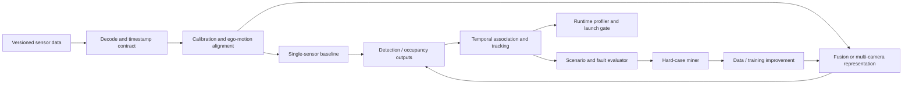

# Autonomy Capstone — Trustworthy Perception Under Sensor Faults

Build a perception system that goes beyond a clean-dataset model demo. The
capstone must combine geometry, temporal reasoning, scenario evaluation,
fault injection, a data-improvement loop, and a measured runtime decision.

This is the main portfolio artifact for a 42dot/autonomous-driving application.
It is also useful for NVIDIA performance roles when the optimization track is
completed and for large-scale ML roles when the data-engine track is completed.

Estimated effort: **80-120 hours** across weeks 9-24.

Role sources were verified **2026-07-11 (Asia/Seoul)**. The architecture and
acceptance criteria below are portfolio recommendations, not a specification
published by 42dot.

## Portfolio claim

At completion, you should be able to defend this claim with evidence:

> I designed and evaluated a calibrated temporal perception stack, measured
> where fusion helped and failed, detected sensor degradation, improved a
> targeted failure slice through a reproducible data loop, and made an explicit
> accuracy-latency-memory launch recommendation.

Do not make the claim until the final acceptance checklist passes.

## Select a data track

Choose during Milestone 0 and record the dataset version and license.

### Track A — Multi-sensor BEV/tracking (recommended)

Use a manageable licensed subset such as nuScenes mini. Implement camera-only
and camera-plus-radar or camera-plus-LiDAR configurations. This track best
demonstrates the current 42dot Senior AI Perception themes of sensor
characteristics, alignment, calibration, BEV/3D/occupancy, fusion and deployed
resource trade-offs.

Primary dataset site: [nuScenes](https://www.nuscenes.org/nuscenes)

### Track B — 42dot multi-camera tracking

Use the official [42dot MCMOT dataset](https://42dot.ai/openDataset/ad/mcmot).
It provides three front-camera streams, cross-camera track IDs and visibility
annotations. Add the synthetic transform/time-fault harness from the curriculum
because MCMOT alone is not a calibrated multi-sensor 3D fusion benchmark.

This track is smaller and directly company-relevant. Do not describe it as
camera-LiDAR fusion or full closed-loop autonomy.

### Track C — Existing public or employer-safe system

Use another public dataset or a sanitized system only when its license permits
portfolio use. Write a one-page equivalence note showing how it still covers
calibration/timing, temporal state, failure slices, degradation and runtime.
Never use confidential employer code, data, architecture or metrics.

## Required system boundary



Every arrow needs a defined schema, frame, timestamp policy, failure behavior
and test owner. A model notebook without these contracts does not pass.

## Repository contract you will create

The final project should contain an equivalent structure:

```text
projects/04_autonomy_capstone/
├── README.md
├── configs/
│   ├── data.yaml
│   ├── baseline.yaml
│   ├── fusion.yaml
│   └── faults.yaml
├── src/
│   ├── data/
│   ├── geometry/
│   ├── models/
│   ├── tracking/
│   ├── evaluation/
│   └── runtime/
├── tests/
├── scripts/
│   ├── prepare_data.py
│   ├── train.py
│   ├── evaluate.py
│   ├── inject_faults.py
│   └── profile.py
├── reports/
│   ├── 00_charter.md
│   ├── 01_data_card.md
│   ├── 02_design_review.md
│   ├── 03_baseline.md
│   ├── 04_fault_review.md
│   ├── 05_runtime.md
│   ├── 06_launch_decision.md
│   └── 07_postmortem.md
└── artifacts/
    ├── figures/
    └── demo/
```

Large raw data, weights and generated outputs must not be committed. Store
checksums, download instructions and small licensed samples instead.

## Milestone 0 — Charter and frozen evaluation plan

Write `reports/00_charter.md` before training.

### Required decisions

- Data track, dataset version, license and checksum strategy.
- Operational design domain assumptions: geography, weather, lighting, speed,
  road types, sensor coverage and excluded cases.
- Primary task and representation: boxes, BEV semantics, occupancy, or tracking.
- Primary metric and five critical slices.
- Target runtime hardware and SLO.
- Three launch blockers and three explicit non-goals.

### Default SLO

Use this unless a different target is frozen with justification:

- batch size 1;
- end-to-end p95 latency `<= 100 ms` after warm-up on named hardware;
- preprocessing and postprocessing included;
- peak memory recorded;
- zero unhandled failed frames in the evaluation run; and
- deterministic or tolerance-bounded output on a fixed sample.

On CPU-only hardware, you may freeze a lower rate, but state the product
consequence. Changing the SLO after seeing the profile requires a dated design
decision, not a silent edit.

### Acceptance criteria

- Metrics, slices, split and SLO are committed before model comparison.
- At least one slice covers range, one occlusion/visibility, one scene density,
  one environment condition and one sensor condition.
- A reviewer can distinguish a launch metric from a diagnostic metric.
- Dataset terms permit the intended use and redistribution policy.

## Milestone 1 — Data, geometry and timing contracts

Write `reports/01_data_card.md` and implement the geometry test harness.

### Required artifacts

- Dataset provenance, schemas, split rationale, class distribution, missing
  fields, known label issues and leakage risks.
- Named frame graph and transform direction convention.
- Sensor capture-time versus arrival-time policy.
- Projection/transform visualization and numeric unit tests.
- Ego-pose interpolation or a documented temporal alignment approximation.

### Required fault fixtures

- extrinsic translation: `0`, `5`, and `10 cm`;
- extrinsic rotation: `0`, `0.5`, and `1 degree`;
- time offset: `0`, `50`, and `100 ms`;
- dropped or stale sensor frame; and
- reversed-transform regression case.

### Acceptance criteria

- Identity, inverse, composition and round-trip tests have maximum synthetic
  error `<= 1e-8` in double precision.
- Hand-computed projection agrees within `1e-6` pixels.
- Reversed-transform fixture causes a test failure.
- Every sample used for qualitative analysis has a stable ID.
- The report predicts the fault effects before measuring them.

## Milestone 2 — Reproducible single-sensor baseline

Train or implement the simplest defensible baseline before fusion.

### Requirements

- One configuration file and one command reproduce preprocessing, inference and
  evaluation.
- Save environment, seed, code commit, dataset version and metric version.
- Validate the metric implementation on a hand-built toy case.
- Profile data decode, preprocessing, model, postprocessing and evaluator
  separately.

### Acceptance criteria

- A clean environment can reproduce the headline metric within a predeclared
  tolerance: default absolute difference `<= 0.5` metric points.
- At least 30 failure examples are assigned to a written taxonomy.
- Report global results plus the five frozen slices.
- Report p50/p95 latency, throughput and peak memory on named hardware.
- No statement uses "real time" without the complete timing method.

## Milestone 3 — Fusion or multi-camera temporal system

Implement the primary architecture and one credible alternative.

### Track A minimum comparison

1. Camera-only baseline.
2. Camera plus the selected second sensor.
3. Late-fusion or single-frame alternative.
4. Missing-sensor/degraded configuration.

### Track B minimum comparison

1. Single-camera or independent-camera association baseline.
2. Cross-camera association with temporal state.
3. Two association costs or gating strategies.
4. Occlusion-aware or track-lifecycle improvement.

### Required ablations

- representation or fusion location;
- temporal context length;
- calibration/time perturbation;
- missing/stale input;
- at least one loss, association or sampling choice; and
- runtime impact of the primary change.

### Acceptance criteria

- Same data split and metric implementation are used for fair comparisons.
- Report absolute results and deltas for every frozen slice.
- Track A reports detection/occupancy quality plus localization or velocity
  error where available. Track B reports IDF1 plus identity-error decomposition.
- Fusion must improve one predeclared critical metric without violating a
  predeclared guardrail. If it does not, passing requires a falsified hypothesis,
  supported root cause and a discriminating next experiment.
- At least two rejected alternatives are documented with evidence.

## Milestone 4 — Sensor degradation and safety review

Run `scripts/inject_faults.py` and write `reports/04_fault_review.md`.

### Fault matrix

| Fault | Detection signal | Expected system response | Required evidence |
|---|---|---|---|
| Time offset/drift | Timestamp age or residual inconsistency | Reject, realign or enter degraded mode | Metric versus offset plot |
| Extrinsic drift | Reprojection/residual monitor | Flag calibration; avoid unsafe fusion | Metric versus perturbation plot |
| Missing frame | Health/sequence counter | Mask sensor and use trained fallback | No crash; degraded metrics |
| Stale frame | Age threshold | Drop or compensate | Latency and accuracy result |
| Corrupt/noisy input | Validity and distribution checks | Bound, reject or degrade | Detection rate and false alarms |
| Dense/occluded scene | Scenario classifier/error miner | Record and prioritize data loop | Slice metric and examples |

### Acceptance criteria

- All faults run from configuration, not manual code edits.
- Metric degradation is plotted against at least three fault magnitudes.
- The health monitor detects every injected missing/stale-frame case in the
  test fixture with no unhandled exception.
- False-positive health alerts are measured on clean data.
- The degraded-mode contract states trigger, behavior, logging, recovery and
  unresolved safety risk.
- A one-page FMEA-style table ranks severity, detectability and mitigation.

## Milestone 5 — Hard-case data iteration

Use the failure evidence to improve one frozen critical slice.

### Required loop

1. Define a query or error rule from baseline failures.
2. Select a training-only hard-case cohort.
3. Audit labels and class/slice balance.
4. Apply one intervention: sampling, augmentation, loss, architecture,
   pseudo-labeling, teacher-student distillation, or tracking logic.
5. Re-evaluate the locked validation/test split and all guardrails.

### Acceptance criteria

- Selected evaluation cases never enter training; demonstrate this with an
  automated ID-intersection test.
- Selection rule and intervention are independently configurable.
- Report target-slice effect, global effect and at least two collateral slices.
- Include a confidence interval or repeated-seed variability where feasible.
- Save examples of improved, unchanged and regressed cases.
- A failed improvement passes only when the initial hypothesis, evidence that
  falsified it, and next experiment are clear.

## Milestone 6 — Runtime optimization and launch decision

Write `reports/05_runtime.md` and `reports/06_launch_decision.md`.

### Profile correctly

- Freeze hardware, driver/runtime versions, clocks/power mode and batch size.
- Warm up before measurement.
- Synchronize asynchronous GPU work correctly.
- Include decode, transfer, preprocessing, inference, postprocessing and
  tracking in end-to-end timing.
- Report p50/p95/p99, throughput, peak CPU/GPU memory and failed frames.

### Perform two measured optimizations

Examples include mixed precision, TensorRT/ONNX export, operator fusion, memory
layout, reduced copies, cached geometry, batched projection, asynchronous I/O,
or a simpler association step. Validate numerical and task-metric differences
after every change.

### Acceptance criteria

- A before/after stage-level profile explains why the bottleneck moved.
- Two optimizations have correctness thresholds and isolated measurements.
- End-to-end p95 meets the frozen SLO, or the launch decision is explicitly
  **NO-GO** with the smallest credible plan to close the gap.
- Accuracy, latency, memory and robustness appear in one decision table.
- Rollout includes shadow/canary validation, monitoring thresholds and rollback.
- The final recommendation names owner, residual risks and evidence still
  required; it is not automatically a launch recommendation.

## Milestone 7 — Closed-loop extension or honest boundary

Open-loop detection metrics are not closed-loop driving evidence.

Choose one:

- integrate the perception output into a small CARLA or equivalent closed-loop
  scenario and measure collision, intervention, route completion and comfort;
  or
- write a closed-loop-readiness design specifying simulator interfaces,
  scenario generation, agent behavior, perception fault injection, planner
  metrics and the expected open-loop/closed-loop disconnect.

### Acceptance criteria

- The README never labels an offline proxy as closed-loop testing.
- At least five safety-relevant scenarios are defined with initial state,
  variation axes, success criterion and deterministic replay information.
- Perception faults can be tied to a downstream behavior hypothesis.
- Limitations explain what cannot be concluded from the capstone.

## Final portfolio artifacts

Produce all of the following:

- one-command or clearly scripted reproduction on a small sample;
- tested geometry and timing code;
- versioned configurations and environment lock;
- data card and model/system card;
- architecture and frame/timing diagrams;
- baseline, fusion/tracking, fault, data-loop and runtime reports;
- 2-4 minute demo with subtitles and scenario IDs;
- 12-slide design review;
- one-page executive launch decision;
- one-page postmortem titled `I was wrong because...`; and
- three resume bullets: algorithm, production and leadership versions.

## Final acceptance checklist

### Correctness and reproducibility

- [ ] Fresh setup reproduces the small-sample pipeline.
- [ ] Geometry/timing unit and regression tests pass.
- [ ] Dataset, split, seed, code, configuration and metric versions are recorded.
- [ ] No evaluation ID leaks into the training hard-case cohort.

### Scientific quality

- [ ] Baseline and primary alternative use a fair comparison.
- [ ] Hypotheses were written before the main ablations.
- [ ] Results include global metrics, five frozen slices and uncertainty where
  feasible.
- [ ] Improved, unchanged and regressed examples are preserved.

### Autonomy judgment

- [ ] Coordinate frames and timestamp semantics are unambiguous.
- [ ] Calibration, time shift, missing/stale sensor and difficult-scene faults
  were injected.
- [ ] Detection, degraded response, recovery and residual risk are documented.
- [ ] Open-loop results are not misrepresented as vehicle safety proof.

### Production quality

- [ ] Named hardware and full end-to-end p50/p95/p99 are reported.
- [ ] Two optimizations include before/after profiles and correctness checks.
- [ ] Accuracy-latency-memory-robustness decision is explicit.
- [ ] Monitoring, rollout and rollback are specified.

### Senior communication

- [ ] Two alternatives were rejected with evidence.
- [ ] Ownership and cross-team interfaces are clear.
- [ ] A reviewer challenged geometry and another challenged deployment/safety.
- [ ] No confidential or unlicensed material is included.
- [ ] A skeptical engineer can reproduce each headline claim.

## Mock interview built from the capstone

Run a 90-minute review:

1. **10 minutes:** problem, ODD, baseline and primary result.
2. **15 minutes:** derive the transform and temporal-alignment model.
3. **15 minutes:** explain a difficult failure cluster and data response.
4. **20 minutes:** redesign for a missing sensor and 30% compute reduction.
5. **15 minutes:** defend launch/no-go, monitoring and rollback.
6. **15 minutes:** leadership questions about disagreement, prioritization and
   what you would change.

Pass when the reviewer can trace claims to evidence and no answer relies on
"the model learns it" without a mechanism or test.

## Role alignment and sources

Verified **2026-07-11**. Requirements below come from official sources; the
capstone design remains preparation guidance.

- [42dot live open roles](https://www.42dot.ai/careers/openroles)
- [Senior Computer Vision Engineer — official indexed role page](https://stage.42dot.ai/careers/openroles/d7f9e679-a018-4ab8-933c-3399995f9da8)
  — 3D CV, pose/tracking, efficient vision, self-supervised scene learning,
  world models, closed-loop simulation, C++/Python, sensors and optimization.
- [Senior AI Perception Engineer — official indexed role page](https://stage.42dot.ai/careers/openroles/d03cec6d-f885-4d4a-bfce-76fd81994731)
  — alignment/calibration/projection, BEV/3D/occupancy, fusion, failure analysis,
  deployment and accuracy-resource decisions.
- [42dot Active Learning article](https://www.42dot.ai/blog/180) — production-
  like failure discovery, hard-case data collection, offline teacher,
  distillation and model improvement.
- [42dot research](https://www.42dot.ai/research) — scene completion, 3D MOT,
  occupancy, depth, lanes and motion research signals.
- [42dot MCMOT](https://42dot.ai/openDataset/ad/mcmot) and
  [autonomous-driving dataset overview](https://42dot.ai/openDataset/ad/overview)
  — official portfolio-safe starting points subject to their current license.
- [HMG Tech Talent Forum 2026: Minwoo Park](https://www.hyundai.com/worldwide/en/newsroom/detail/0000001193)
  — strategic emphasis on production scale, data flywheels, sensor
  standardization, cross-functional execution, and safety/reliability. This is
  company-direction context, not a capstone brief or interview rubric.

